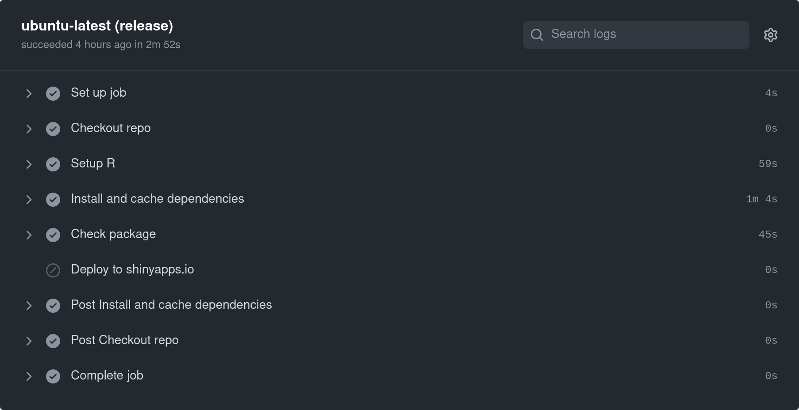
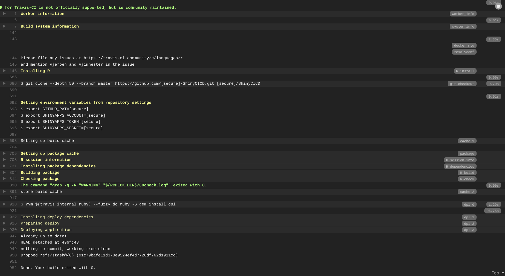

# CI/CD pipelines for automatic deployment of a R Shiny web app

```{r setup-shiny-ci-cd, include=FALSE}
knitr::opts_chunk$set(echo = TRUE, collapse = TRUE, eval = FALSE)
```

It is good practice to integrate and develop an R Shiny app as an R package, to take full advantage of all the integrated features established for R packages (e.g., documentation, package namespaces, automated testing, `R CMD check`, etc.). A typical development workflow to package a Shiny app is provided by the [`golem` package](https://cran.r-project.org/web/packages/golem/index.html). Later in this chapter we will also indicate how to package a shiny app without the infrastructure provided by `golem`.

Furthermore, version control systems such as Git are a great asset for keeping track an manage changes, especially in a collaborative setup.

The development of a packaged Shiny app under version control can easily enable and take advantage of:

- Continuous Integration (CI) pipelines to automate checks and ensure higher code quality and robustness;
- Continuous Deployment (CD) pipelines to automate the process of deployment to a _productive_ environment.

This guide illustrates how to set up CI/CD pipelines with a focus on the increasingly popular [GitHub Actions](https://github.com/features/actions), which we recommend as a natural choice for GitHub open source projects. In particular, it shows how a Shiny app developed as an R package can be maintained on a GitHub repository, be deployed to and hosted on [shinyapps.io](https://www.shinyapps.io) using said CI/CD pipelines. For the sake of completeness, and for historical reasons, the guide also covers the CI/CD setup on [Travis CI](https://travis-ci.com), a well established service that has become not attractive any longer for open source projects due to its change of policy in recent years.

[ShinyCICD](https://github.com/miraisolutions/ShinyCICD) is a minimal example of a packaged Shiny app that will be used as an example throughout the guide. You can simply [fork](https://docs.github.com/en/free-pro-team@latest/github/getting-started-with-github/fork-a-repo) the repository and setup your specific user settings (especially for shinyapps.io) to see CI/CD pipelines in actions, or follow the steps described below to setup CI/CD pipelines for your own app.

## Generic CI/CD pipeline

Generally speaking, a CI/CD pipeline related to an R package is comprised of the following steps:

- setup a running environment
- setup R
- check out the package source code
- install system dependencies
- install package dependencies (with caching)
- build the package
- check the package
- deploy

GitHub Actions provides great flexibility in specifying and customizing each individual step, but many are covered by the R-specific actions provided by the [r-lib/actions](https://github.com/r-lib/actions#readme) project. Most of these steps are implemented by default in Travis CI for an R package.

## GitHub Actions

[GitHub Actions](https://docs.github.com/en/free-pro-team@latest/actions) is a service for running highly-customizable and flexible automated workflows, fully integrated with GitHub and very suitable to CI/CD pipelines.
[Workflows](https://docs.github.com/en/free-pro-team@latest/actions/reference/workflow-syntax-for-github-actions) use `YAML` syntax and should be stored in the `.github/workflows` directory in the root of the repository.
Workflows are constituted of jobs and each job is a set of steps to perform individual tasks, e.g. commands or actions.

The next sections describe in detail the relevant workflow steps of a typical CI/CD pipeline for a packages Shiny app, also covering the usage of `renv` to track package dependencies. Finally, we will show how you can use the convenience function `usethis::use_github_action()` for including such workflows in you project.

### Workflow steps

A workflow should have an identifying `name` and an `on` section that indicates upon which events the workflow should be triggered. It should include at least one job and each job will have a set of steps fully specifying what to execute. Such steps can be an action (predefined, sourcing from GitHub repos that contain such actions) or a script. However, for the time being, GitHub Actions does not provide a mature support for hierarchical, aggregated structure of actions. Being entirely customizable, it is necessary to fully specify each step in the CI/CD pipeline explicitly.

#### Setup

- Checkout the source package from the repository, using `actions/checkout` provided by GitHub.
- Setup R using the action [`r-lib/actions/setup-r`](https://github.com/r-lib/actions#readme).
- Query and cache R package dependencies using `remotes::dev_package_deps()` and the `actions/cache` predefined action.
- Install system dependencies (for the `ubuntu` runner defined for the workflow) using `sysreqs::sysreq_commands()`.
- Install R package dependencies using `remotes::install_deps()`.

##### Using renv {-}

If your project relies on package [renv](https://rstudio.github.io/renv) for tracking dependencies via an `renv.lock` file, caching and installation of R package dependencies requires a different setup, as described in the [Using renv with Continuous Integration](https://rstudio.github.io/renv/articles/ci.html#github-actions) vignette and shown in complete workflow files [below](#complete-wfs-use-gh-action).

#### Package check

- Check the package via `rcmdcheck::rcmdcheck()`.

#### Deployment

- Continuous deployment to shinyapps.io is automated upon any push to the `master` branch
  - In order to provide credentials for the deployment, account name and corresponding [tokens](https://docs.rstudio.com/shinyapps.io/getting-started.html#deploying-applications) for shinyapps.io are defined as environment variables `SHINYAPPS_ACCOUNT`, `SHINYAPPS_TOKEN` and `SHINYAPPS_SECRET`, specified / accessible as GitHub [secrets](https://docs.github.com/en/free-pro-team@latest/actions/reference#authentication-and-secrets).
  - A convenience R script, e.g. `deploy/deploy-shinyapps.R` (build-ignored via `usethis::use_build_ignore("deploy")`), defines the deployment commands based on the environment variables.
```{r read-deploy-script, eval = TRUE, echo = FALSE}
knitr::read_chunk("shiny-ci-cd/deploy/deploy-shinyapps.R", labels = "deploy-shinyapps")
```
```{r deploy-shinyapps}
```

### Workflow file

```{r read-ci-cd.yml, eval = TRUE, include = FALSE}
file.copy("shiny-ci-cd", "_book", recursive = TRUE)
knitr::read_chunk("shiny-ci-cd/actions/ci-cd.yml", labels = "ci-cd.yml")
knitr::read_chunk("shiny-ci-cd/actions/ci-cd-renv.yml", labels = "ci-cd-renv.yml")
knitr::read_chunk("shiny-ci-cd/actions/ci.yml", labels = "ci.yml")
knitr::read_chunk("shiny-ci-cd/actions/ci-renv.yml", labels = "ci-renv.yml")
```

The `steps` described in the previous section are defined in the `.yml` workflow file as follows:

```{yml ci-cd.yml}
```

As visible from the run logs that can be found in the GitHub repository under the `Actions` tab, all the CI/CD pipeline steps are performed subsequently, and are identifiable by the `name` field. See the example below, showing how the deployment step is skipped for a run not triggered by a push action on `master`:



### Complete workflows and `usethis::use_github_action()` {#complete-wfs-use-gh-action}

Full YAML workflows for CI and CI/CD pipelines, with and without `renv`, are shown below and provided as part of this guide.

In order to setup and use CI/CD GitHub Actions workflows as described above, you can simply include the relevant workflow file your project via:
```{r}
usethis::use_github_action(
  url = 
    "https://mirai-solutions.ch/techguides/shiny-ci-cd/actions/ci-cd.yml"
  # "https://mirai-solutions.ch/techguides/shiny-ci-cd/actions/ci-cd-renv.yml"
  # "https://mirai-solutions.ch/techguides/shiny-ci-cd/actions/ci.yml"
  # "https://mirai-solutions.ch/techguides/shiny-ci-cd/actions/ci-renv.yml"
)
usethis::use_github_actions_badge("CI-CD") # or "CI"
```

#### Complete workflow files

<details>
<summary><code>shiny-ci-cd/actions/ci-cd.yml</code></summary>
```{yml ci-cd.yml}
```
</details>

<details>
<summary><code>shiny-ci-cd/actions/ci-cd-renv.yml</code></summary>
```{yml ci-cd-renv.yml}
```
</details>

<details>
<summary><code>shiny-ci-cd/actions/ci.yml</code></summary>
```{yml ci.yml}
```
</details>

<details>
<summary><code>shiny-ci-cd/actions/ci-renv.yml</code></summary>
```{yml ci-renv.yml}
```
</details>


## Travis CI

Travis CI is a continuous integration service that can be used to build and test software projects hosted on GitHub. To set up Travis CI you need to login at [https://travis-ci.com/](https://travis-ci.com/) (using your GitHub account) and provide authorization via GitHub (see [Travis CI Tutorial](https://docs.travis-ci.com/user/tutorial)).

Travis CI used to be a very established, mature and popular tool in the open-source source community, before a recent change of policy made it less focused on open-source, offering only limited free trial plans.

### Standard CI setup

To setup Travis CI in a project use:

```{r, eval = F}
usethis::use_travis() # use ext = "com" if usethis < 1.6.0
```

This will generate a generic `.travis.yml` file

```yaml
# R for travis: see documentation at https://docs.travis-ci.com/user/languages/r

language: R
cache: packages
```

As default, Travis CI takes care of package dependency installation and performs the typical package build & check you would run locally via e.g. `devtools::check()`. Such a CI pipeline is triggered by any push event on any branch on the GitHub repo, including pull requests.


### Using renv for your project

If your project relies on the package [renv](https://rstudio.github.io/renv) for tracking dependencies via an `renv.lock` file, you should override the default `install`ation package dependencies and make sure `cache`ing is adjusted accordingly, as described in the [Using renv with Continuous Integration](https://rstudio.github.io/renv/articles/ci.html
) vignette:
```yaml
cache:
  directories:
  - $HOME/.local/share/renv
  - $TRAVIS_BUILD_DIR/renv/library

install:
  - Rscript -e "if (!requireNamespace('renv', quietly = TRUE)) install.packages('renv')"
  - Rscript -e "renv::restore()"
```

### Automated deployment

Travis CI can be setup to perform a deployment (e.g. publish a shiny app on [shinyapps.io](https://www.shinyapps.io/)) upon any push to the `master` branch, provided the CI checks pass.

This is achieved for a shinyapps.io deployment by specifying in `.travis.yml` an additional `deploy:` section as

```yaml
deploy:
  provider: script
  skip_cleanup: true # strictly necessary only for the renv case
  script:
  - >-
    Rscript
    -e 'account_info <- lapply(paste0("SHINYAPPS_", c("ACCOUNT", "TOKEN", "SECRET")), Sys.getenv)'
    -e 'do.call(rsconnect::setAccountInfo, account_info)'
    -e 'rsconnect::deployApp(appName = "ShinyCICD")'
  on:
    branch: master
```

where `SHINYAPPS_ACCOUNT`, `SHINYAPPS_TOKEN`, `SHINYAPPS_SECRET` are [secure variables defined on Travis CI](https://docs.travis-ci.com/user/environment-variables/) holding your account name and corresponding  [tokens](https://docs.rstudio.com/shinyapps.io/getting-started.html#deploying-applications) for shinyapps.io.

It is in fact more convenient to write an R script, saved as e.g. `deploy/deploy-shinyapps.R` (build-ignored via `usethis::use_build_ignore("deploy")`) defining the deployment commands:
```{r deploy-shinyapps}
```

and then simply execute it as `deploy` `script`:
```yml
deploy:
  provider: script
  skip_cleanup: true # strictly necessary only for the renv case
  script: Rscript deploy/deploy-shinyapps.R
  on:
    branch: master
```

### Putting it all together

The final `.travis.yml` file (for the non-renv case) would look like

```yaml
# R for travis: see documentation at https://docs.travis-ci.com/user/languages/r

language: R
cache: packages

deploy:
  provider: script
  script: Rscript deploy/deploy-shinyapps.R
  on:
    branch: master
```

As visible from the run logs, all the CI/CD pipeline steps are performed, despite only the deployment step being explicitly defined.




## Deploying a packaged shiny application

It makes sense to structure shiny applications as a package to better control their dependencies. However, some structural conditions are required for the deployment of a packaged shiny application. 

As already mentioned, one option is to use the [`golem` package](https://cran.r-project.org/web/packages/golem/index.html), which will initialize the shiny application with its framework that does support deployment of a shiny application as a package. But sometimes you may not want to add an entire framework to an existing application and instead add this support manually.

Since we did not find any good documentation of this online (as of Nov 2020), we investigated this ourselves and are happy to share our findings here.

### Entry point

The application needs an entry point which should be named `app.R` and be situated in the root of the package, i.e. where 
`DESCRIPTION` and `NAMESPACE` are located. 

It should contain only what is required for the entry point to be able to load the application, e.g.:

```{r, eval = F}
pkgload::load_all(export_all = FALSE, helpers = FALSE, attach_testthat = FALSE)
# PKG is the name of the packaged shiny application
# run_PKG_app is a function that wraps around shiny::shinyApp()
PKG::run_PKG_app()
```

```{r, eval = F}
run_PKG_app <- function() {
  shinyApp(ui = ui, server = server)
}
# where ui and server are both functions
```

### server and ui

Both `server` and `ui` need to be functions in order to work in the packaged shiny application context. `server` should already be a function and it is enough to wrap `ui` into a function without any arguments or return statements.

In the beginning of the `ui` function, we also need to add a call to `shiny::addResourcePath` to make static resources available.

### non-CRAN dependencies

Deploying a packaged shiny application which uses non-CRAN package sources like Github requires additional information in the `DESCRIPTION` file. Namely, the repository details of such dependencies must be included in a [`Remotes:`](https://cran.r-project.org/web/packages/devtools/vignettes/dependencies.html) field, so that tools like `renv` or `remotes` know where the packages should be retrieved from.
